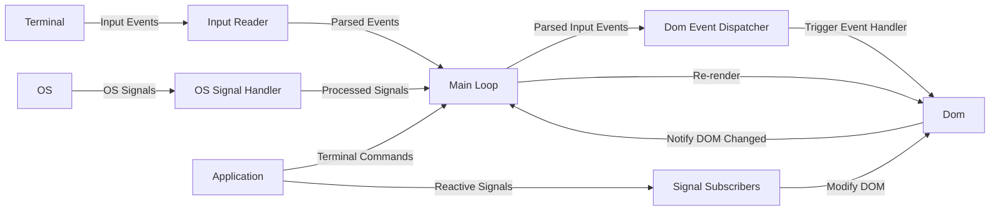

# Architecture

Rooibos is a [retained mode](https://en.wikipedia.org/wiki/Retained_mode) UI that uses an asynchronous event loop combined with a thread-local widget tree to manage application state.
The reactivity model is built using the underlying crates that power Leptos (version 0.7)'s rendering system, namely [`tachys`](https://docs.rs/tachys/latest/tachys/) for fine-grained layout tree updates and [`reactive_graph`](https://docs.rs/reactive_graph/latest/reactive_graph/) for signals.
Unfortunately, Leptos had to remove support for generic rendering due to ballooning compile times on large web projects (see [the PR](https://github.com/leptos-rs/leptos/pull/3015)) so we use a [soft fork of tachys](https://github.com/aschey/leptos/tree/main/tachys) which restores the generic rendering functionality.

## The DOM

The DOM is a tree structure of Ratatui widgets and layout containers that is rendered on every iteration of the event loop.
Ratatui requires all widgets to be written to a buffer during each render, so we store these widgets as function pointers inside a `Rc<RefCell>` which can be re-invoked without having to unnecessarily clone the widget's inputs.
Whenever possible, we invoke [`render_ref`](https://docs.rs/ratatui/latest/ratatui/widgets/trait.WidgetRef.html#tymethod.render_ref) to avoid cloning the widget itself, as well.
In the future, we could use Ratatui's lower level APIs to only re-render the parts of the screen that we know have changed.

When a part of the DOM is updated, it sends a message that tells the event loop that it needs to re-render.

## Signals

Signals are special variables that trigger any subscription functions to be re-ran.
This is the only mechanism that can update a DOM node and trigger a re-render, aside from a few special commands that alter the terminal state.
Signals can be updated from any thread or asynchronous task, which removes the need for applications to explicitly handle coordination between the UI thread and their event handlers or background tasks in order to trigger a UI update.

## The Event Loop

Rooibos' runtime manages the event loop to coordinate any inputs that come in.
There's several advantages to using an async model here:

- We need to be able to wait for any of several types of events to occur. Tokio's `select!` is perfect for this.
- There's no need to poll for a set period of time and re-run the loop more than necessary
- Sometimes we need to cancel and optionally restart a task, async offers a more ergonomic approach for dealing with this.

## Rendering Model

