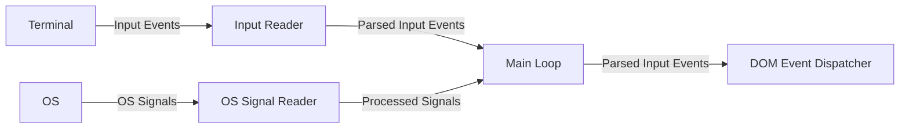
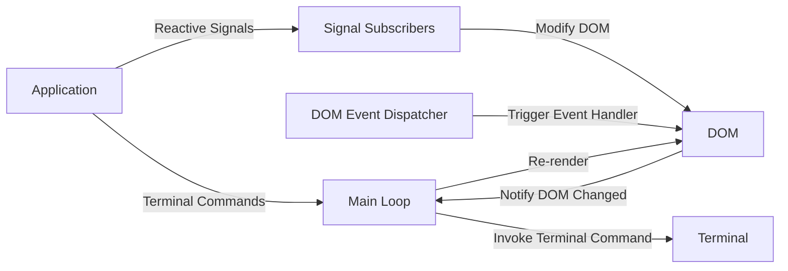

# Architecture

Rooibos is a [retained mode](https://en.wikipedia.org/wiki/Retained_mode) UI
that uses an asynchronous event loop combined with a thread-local widget tree to
manage application state. The reactivity model is built using the underlying
crates that power Leptos (version 0.7)'s rendering system, namely
[`tachys`](https://docs.rs/tachys/latest/tachys/) for fine-grained layout tree
updates and
[`reactive_graph`](https://docs.rs/reactive_graph/latest/reactive_graph/) for
signals. Unfortunately, Leptos had to remove support for generic rendering due
to ballooning compile times on large web projects (see
[this PR](https://github.com/leptos-rs/leptos/pull/3015)) so we use a
[soft fork of tachys](https://github.com/aschey/leptos/tree/main/tachys) which
restores the generic rendering functionality.

## The DOM

The DOM is a tree structure of Ratatui widgets and layout containers that is
rendered on every iteration of the event loop. Ratatui requires all widgets to
be written to a buffer during each render, so we store these widgets as function
pointers inside a `Rc<RefCell>` which can be re-invoked without having to
unnecessarily clone the widget's inputs. Whenever possible, we invoke
[`render_ref`](https://docs.rs/ratatui/latest/ratatui/widgets/trait.WidgetRef.html#tymethod.render_ref)
to avoid cloning the widget itself, as well. In the future, we could use
Ratatui's lower level APIs to only re-render the parts of the screen that we
know have changed.

The DOM is represented using a
[`slotmap`](https://docs.rs/slotmap/latest/slotmap/). The slotmap structure is
stored as a thread local variable and each of the DOM nodes keeps track of where
it is in the tree based on the slotmap key. These keys are used in other parts
of the framework to modify the DOM. (This is the same technique that
`reactive_graph` uses to track signals internally).

When a part of the DOM is updated, it sends a message that tells the event loop
that it needs to re-render.

## Signals

Signals are special variables that trigger any subscription functions to be
re-ran. This is the only mechanism that can update a DOM node and trigger a
re-render, aside from a few special commands that alter the terminal state.
Signals can be updated from any thread or asynchronous task, which removes the
need for applications to explicitly handle coordination between the UI thread
and their event handlers or background tasks in order to trigger a UI update.

## The Event Loop

Rooibos' runtime manages the event loop to coordinate any inputs that come in.
There's several advantages to using an async model here:

- We need to be able to wait for any of several types of events to occur.
  Tokio's `select!` is perfect for this.
- There's no need to poll for a set period of time and re-run the loop more than
  necessary
- Sometimes we need to cancel and optionally restart a task, async offers a more
  ergonomic approach for dealing with this.
- Often, single-threaded concurrency is sufficient to handle the small number of
  tasks in an application that's designed for a single user. Using a
  single-threaded runtime allows the application to run concurrent tasks without
  blocking the UI and avoiding the overhead of spawning threads.

## Structure

Rooibos is designed to be modular, allowing the application logic to be
separated from the backend. Additionally, the reactive system can be used
without the runtime layer and the DOM can be used without the reactive system.

An example of how to create an (overly simplified) Elm-based architecture on top
of the DOM layer is given [here](./crates/rooibos-dom/examples/elm.rs).

An example of running an application without the runtime layer is shown
[here](./examples/examples/no_runtime.rs).

- [**`rooibos-dom`**](./crates/rooibos-dom) - Structures for representing user
  interfaces as a tree of nodes, loosely based on the DOM model from HTML
- [**`rooibos-reactive`**](./crates/rooibos-reactive) - Implements signal-based
  reactivity on top of `rooibos-dom`
- [**`rooibos-reactive-macros`**](./crates/rooibos-reactive-macros) - Procedural
  macros for setting up the reactive system
- [**`rooibos-terminal`**](./crates/rooibos-terminal) - Abstraction for using
  Rooibos with different terminal backends
- [**`rooibos-components`**](./crates/rooibos-components) - High-level reactive
  UI components
- [**`rooibos-runtime`**](./crates/rooibos-runtime) - Application runtime for
  managing the event loop
- [**`rooibos-tester`**](./crates/rooibos-tester) - Harness for testing
  components using an in-memory backend
- [**`rooibos-router`**](./crates/rooibos-router) - Router component, useful for
  multi-screen applications
- [**`rooibos-router-macros`**](./crates/rooibos-router-macros) - Procedural
  macros for type-safe routing
- [**`rooibos-ssh`**](./crates/rooibos-ssh) - Serves Rooibos applications over
  SSH
- [**`rooibos-xterm-js`**](./crates/rooibos-xterm-js) - Serves Rooibos
  applications on the browser using [xterm-js](https://xtermjs.org/)
- [**`rooibos-config`**](./crates/rooibos-config) - Utility for integrating
  configuration files with live reload support

## Event Handling

### Glossary

- **Terminal** - The terminal application
- **Application** - Logic implemented in the end user application rather than
  the framework
- **DOM** - Widget tree stored on the main/UI thread
- **Input Reader** - An async task that listens for terminal events and maps
  them from a backend-specific structure to a common one
- **OS Signal Reader** - An async task that listens for signals from the
  underlying OS and maps them from a specific code to a common structure
- **Main Loop** - The application's main loop that's responsible for
  coordinating events that need to be processed on the main thread
- **DOM Event Dispatcher** - A component in the DOM that routes events to
  specific nodes that may be interested (e.g. click events need to go to the
  correct element)
- **Signal Subscribers** - Async tasks inside of the reactive graph that are
  invoked when their reactive signals are modified
- **Terminal Commands** - Commands that can be dispatched by the end user
  application that modify the terminal state, such as changing the title

### Terminal Event and Signal Handling

### User Event Handling

