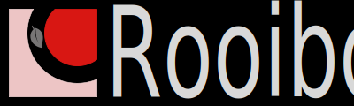
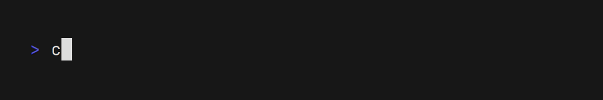
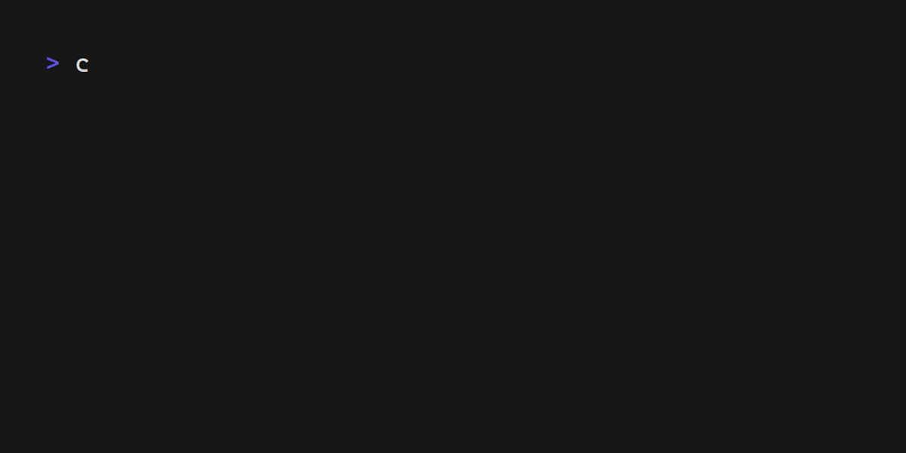

<div align="center">



**TUI apps that run anywhere**


[](https://github.com/aschey/rooibos/actions/workflows/test.yml)


</div>

**NOTE:** This project is currently in a pre-alpha state and should not be used for anything beyond experimentation yet.

## Intro

Rooibos is an application framework for creating TUI ([text-based user interface](https://en.wikipedia.org/wiki/Text-based_user_interface)) apps that can run in a variety of different environments - in the terminal, web, desktop and more.
It uses [Leptos'](https://github.com/leptos-rs/leptos) [signal-based](https://github.com/leptos-rs/leptos/tree/main/reactive_graph) reactivity model to create declarative user interfaces.
Elements are rendered to the screen using [Ratatui](https://docs.rs/ratatui/latest/ratatui/) widgets.



The example above can be written using the following code:

```rust
use std::process::ExitCode;

use rooibos::dom::{line, span, KeyCode, KeyEvent};
use rooibos::reactive::graph::signal::signal;
use rooibos::reactive::graph::traits::{Get, Update};
use rooibos::reactive::{mount, wgt, Render};
use rooibos::runtime::error::RuntimeError;
use rooibos::runtime::Runtime;
use rooibos::terminal::crossterm::CrosstermBackend;
use rooibos::tui::style::Stylize;

type Result = std::result::Result<ExitCode, RuntimeError>;

#[rooibos::main]
async fn main() -> Result {
    mount(app);
    let runtime = Runtime::initialize(CrosstermBackend::stdout());
    runtime.run().await
}

fn app() -> impl Render {
    let (count, set_count) = signal(0);

    let update_count = move || set_count.update(|c| *c += 1);

    let key_down = move |key_event: KeyEvent, _, _| {
        if key_event.code == KeyCode::Enter {
            update_count();
        }
    };

    wgt!(line!("count: ".bold(), span!(count.get()).cyan()))
        .on_key_down(key_down)
        .on_click(move |_, _, _| update_count())
}
```

## Feature Overview

- Declarative and reactive style for building UIs
- Easy-to-use event handlers with mouse support
- Compatibility with Ratatui and its widget ecosystem
- Flexbox and grid layouts powered by [taffy](https://docs.rs/taffy/latest/taffy/)
- Render your applications on the web, desktop, SSH, or mobile with minimal changes
- First-class async integration

## Demo



## Examples

See [examples](./examples/examples).

## Architecture

See [architecture](./ARCHITECTURE.md).

## Backend Support Status

| Name                                                | Backend                                                        | Type     | Status                            |
| --------------------------------------------------- | -------------------------------------------------------------- | -------- | --------------------------------- |
| [**`rooibos-terminal`**](./crates/rooibos-terminal) | [crossterm](https://docs.rs/crossterm/latest/crossterm/)       | Terminal | Implemented                       |
| [**`rooibos-terminal`**](./crates/rooibos-terminal) | [termion](https://docs.rs/termion/latest/termion/)             | Terminal | Implemented, but missing features |
| [**`rooibos-terminal`**](./crates/rooibos-terminal) | [termwiz](https://docs.rs/termwiz/latest/termwiz/)             | Terminal | Implemented, but missing features |
| [**`rooibos-ssh`**](./crates/rooibos-ssh)           | [russh](https://docs.rs/russh/latest/russh/)                   | SSH      | Implemented                       |
| [**`rooibos-xterm-js`**](./crates/rooibos-xterm-js) | [xterm-js-rs](https://docs.rs/xterm-js-rs/latest/xterm_js_rs/) | Web      | Implemented                       |
| **`rooibos-egui`**                                  | [egui](https://docs.rs/egui/latest/egui/)                      | Desktop  | Planned                           |
| **`rooibos-egui`**                                  | [egui](https://docs.rs/egui/latest/egui/)                      | Mobile   | Planned                           |
| **`rooibos-bevy`**                                  | [bevy](https://docs.rs/bevy/latest/bevy/)                      | Games    | Planned                           |

## Structure

- [**`rooibos-dom`**](./crates/rooibos-dom) - Structures for representing user interfaces as a tree of nodes, loosely based on the DOM model from HTML
- [**`rooibos-reactive`**](./crates/rooibos-reactive) - Implements signal-based reactivity on top of `rooibos-dom`
- [**`rooibos-reactive-macros`**](./crates/rooibos-reactive-macros) - Procedural macros for setting up the reactive system
- [**`rooibos-terminal`**](./crates/rooibos-terminal) - Abstraction for using Rooibos with different terminal backends
- [**`rooibos-components`**](./crates/rooibos-components) - High-level reactive UI components
- [**`rooibos-runtime`**](./crates/rooibos-runtime) - Application runtime for managing the event loop
- [**`rooibos-tester`**](./crates/rooibos-tester) - Harness for testing components using an in-memory backend
- [**`rooibos-router`**](./crates/rooibos-router) - Router component, useful for multi-screen applications
- [**`rooibos-router-macros`**](./crates/rooibos-router-macros) - Procedural macros for type-safe routing
- [**`rooibos-ssh`**](./crates/rooibos-ssh) - Serves Rooibos applications over SSH
- [**`rooibos-xterm-js`**](./crates/rooibos-xterm-js) - Serves Rooibos applications on the brower using [xterm-js](https://xtermjs.org/)
- [**`rooibos-config`**](./crates/rooibos-config) - Utility for integrating configuration files with live reload support
